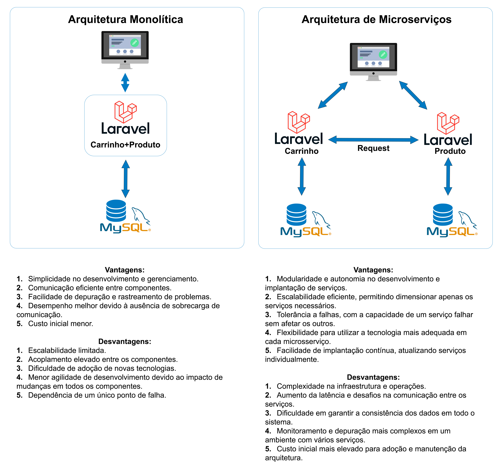

# ExercicioMicroservices

CARRINHO: (php artisan serve --port 8000) 
BANCO: 
DB_CONNECTION=mysql 
DB_HOST=127.0.0.1 
DB_PORT=3306 
DB_DATABASE=carrinho_ms 
DB_USERNAME=root 
DB_PASSWORD=senha  
ROTAS: 
POST: http://localhost:8000/api/carrinho/add (Adiocona um produto no carrinho)  
variaveis: produto_id, quantidade, carrinho_id (se nulo cria um carrinho) 
DELETE: http://localhost:8000/api/carrinho/remove/{ID} (Remove um produto do carrinho,  se > 1 decrementa) 
POST: http://localhost:8000/api/carrinho/finaliza/{ID} (Finaliza e da baixa no estoque do produto, se ficar negativo cancela a operacao)  
PRODUTO: (php artisan serve --port 8001) 
BANCO: 
DB_CONNECTION=mysql 
DB_HOST=127.0.0.1 
DB_PORT=3306 
DB_DATABASE=produtos_ms 
DB_USERNAME=root 
DB_PASSWORD=senha  
ROTAS: 
GET http://localhost:8001/api/produtos (Retorna todos os produtos) 
GET http://localhost:8001/api/produtos/{ID} (Retorna um produto) 
POST http://localhost:8001/api/produtos (Adiciona um produto) 
variaveis: nome, descricao, valor, estoque 
PUT http://localhost:8001/api/produtos/{ID} (Altera um produto) 
variaveis: nome, descricao, valor, estoque 
DELETE http://localhost:8001/api/produtos/{ID} (Remove um produto) 
